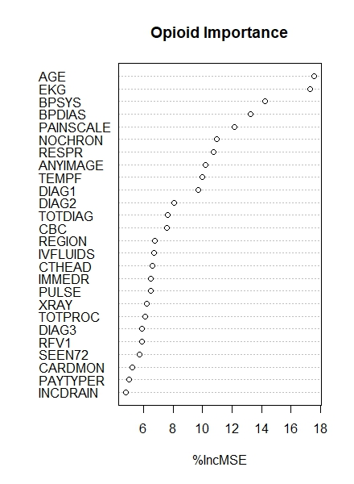

## Abstract
The opioid epidemic in the United States is a problem that has only recently seen sharper corrective action including the March 2016 CDC guidelines on opioid prescription. Using 2018-2019 CDC data, we developed a random forests model that was used to predict overprescriptions from 2013-Feb 2016. The most important variables in prescribing opioids were determined to be age, reported painscale, and pre-existing chronic conditions. The model had low specificity and was not very succesful at predicting opioid prescriptions, but we were able to find strong evidence showing that females, whites, and insurance holders were more likely to be overprescribed. Limitations include the use of only emergency hospitalizations and the lack of model specificity.

## Introduction
The overprescription of opioids has become a growing concern in the United States, with an estimated [1.6 million](https://www.hhs.gov/opioids/statistics/index.html#:~:text=Facts%20about%20Drug%20Overdose,epidemic%20data%20from%20the%20CDC) Americans struggling with opioid addiction. There were over [70,000 opioid overdose related deaths in 2021](https://nida.nih.gov/research-topics/trends-statistics/overdose-death-rates). In 2016, the Centers for Disease Control and Prevention (CDC) released [guidelines](https://www.cdc.gov/mmwr/volumes/65/rr/rr6501e1.htm) for prescribing opioids for chronic pain, aiming to address the issue of overprescription. However, the effectiveness of these guidelines in reducing opioid prescriptions and opioid-related harm is yet to be fully understood. In this project, we will use machine learning models in R to analyze the impact of the 2016 CDC guidelines (treated as the correct standard for prescription in our approach) on opioid prescription rates and the associated harm. We will explore various factors that contribute to overprescription of opioids, such as patient socio-demographics, medical conditions, diagnoses, and treatment characteristics. The goal of this project is to train a model on data after the CDC published new guidelines and then use this model to find the level of over-prescription of opioids in the previous years.  

### Overview of 2016 CDC Guidelines  

The CDC guidelines for prescribing opioids for chronic pain, published in March 2016, provide recommendations to healthcare providers to improve patient safety and reduce the risk of opioid-related harms. The guidelines recommend the use of non-opioid therapies as the preferred treatment for chronic pain and suggest that opioids should only be prescribed after considering other treatment options. The guidelines also recommend that healthcare providers establish treatment goals and regularly monitor patients for benefits and harms of opioid therapy. Additionally, the guidelines suggest limiting the duration of opioid therapy to three days or less for acute pain and to the lowest effective dose for chronic pain. Finally, the guidelines provide recommendations for mitigating the risks associated with opioid therapy, such as using prescription drug monitoring programs and assessing patients for risk factors for opioid misuse or addiction.


```{r setup, include=FALSE}
library(ggplot2)
library(dplyr)
library(rsample)
library(caret)
library(tidyverse)
library(rpart)
library(rpart.plot)
library(rsample) 
library(randomForest)
library(lubridate)
library(modelr)
library(verification)
library(gamlr)
library(knitr)
knitr::opts_chunk$set(echo = TRUE)

opioid_df = read.csv("data/data_final.csv")
# load(file = "data/data.RData") # Can be used if you run code separately in .r file, save Env as data1.Rdata (knitting is slow)
```

## Methodology 
This section provides an overview of the methodology used for analysis including steps on data collection, processing, and running the predictive models to replicate our results. STATA was used for primary data cleaning and R was used for data processing and implementing machine learning models. 

### Data Collection and Processing
[Source]( https://ftp.cdc.gov/pub/Health_Statistics/NCHS/Datasets/NHAMCS/): National Hospital Ambulatory Medical Care Survey (NHAMCS)

*   The National Hospital Ambulatory Medical Care Survey (NHAMCS) collects data on the utilization and provision of ambulatory care services in hospital emergency and outpatient departments and ambulatory surgery locations. This is a national sample of visits to the emergency departments,  outpatient departments, and ambulatory surgery locations of noninstitutional general and short-stay hospitals.
*   Data was downloaded for 2013-2019. The default file format is .dta (STATA dataset). Each year contains about 20,000 observations across 1000 variables including information on perscribed medication. The codebook found on the CDC website also labelled medications with their generic names, 9 of which are the generic names of opioids (fentanyl, buprenorphine, hydromorphone, hydrocodone, methadone, morphine, tapentadol, oxycodone, and codeine) according to the American Society of Addition Medicine.

*   Pre-processing was done in STATA using a [cleaning script](https://github.com/pranjalmaheshka/eco395m-sp23-DataMining/tree/main/Final-Project/stata) provided by the CDC and then the files were exported as .csv’s in order to process them in R. 

*   In order to reproduce the results, save the csv files were saved locally due to their size and then run [data_cleaning.r](https://github.com/pranjalmaheshka/eco395m-sp23-DataMining/blob/main/Final-Project/data_cleaning.R). This file subsets the data down to relevant socio-demographic features, medical diagnoses, patient’s medical history, and type of care provided. 

*   Information about prescribed medication is cross-referenced with CDC data to determine which patients were given opioids including type and potency which were saved as `opioid` (=1 if prescribed an opioid), `potency` (measured relative to morphine = 1), `opioids` (total number of opioids prescribed). Two opioid classification information files needed to run the data cleaning script can be found [here]( https://github.com/pranjalmaheshka/eco395m-sp23-DataMining/tree/main/Final-Project/data). 

*   The final cleaned file is available [here]( https://github.com/pranjalmaheshka/eco395m-sp23-DataMining/tree/main/Final-Project/data). 
The final data set includes 145,630 observations across 94 variables including 3 opioid variables generated. 

```{r data_wrangling, include=FALSE, cache=TRUE}
factor(opioid_df$VDAYR)
factor(opioid_df$VMONTH)
factor(opioid_df$RESIDNCE)
opioid_df$SEX<-ifelse(opioid_df$SEX=="Female",1,0)
factor(opioid_df$RACEUN)
factor(opioid_df$REGION)
factor(opioid_df$ETHIM)
factor(opioid_df$IMMEDR)
factor(opioid_df$PAYTYPER)

opioid_df$AGE<-ifelse(opioid_df$AGE=="Under one year",1, opioid_df$AGE)
opioid_df$AGE<-ifelse(opioid_df$AGE=="93 years and over",93, opioid_df$AGE)

opioid_df$PAINSCALE<-ifelse(opioid_df$PAINSCALE=="Blank"|opioid_df$PAINSCALE=="Unknown",0,opioid_df$PAINSCALE)
opioid_df$PAINSCALE<-as.numeric(opioid_df$PAINSCALE)
opioid_df$AGE = as.numeric(opioid_df$AGE)

opioid_df = opioid_df %>%
  mutate(pre2016 = ifelse(YEAR < 2016 | (YEAR==2016 & 
                                           (VMONTH == 'January' | VMONTH == 'February')), 1, 0),
         PAYMCARE = ifelse(PAYMCARE == "Yes", 1, 0),
         PAYPRIV = ifelse(PAYPRIV == "Yes", 1, 0))

opioid_df = opioid_df%>%
  mutate(DIAG1 = ifelse(is.na(DIAG1), "BLANK", DIAG1))
opioid_df = opioid_df%>%
  mutate(DIAG2 = ifelse(is.na(DIAG2), "BLANK", DIAG2))
opioid_df = opioid_df%>%
  mutate(DIAG3 = ifelse(is.na(DIAG3), "BLANK", DIAG3))

factor(opioid_df$DIAG1)
factor(opioid_df$DIAG2)
factor(opioid_df$DIAG3)
factor(opioid_df$RFV1)
factor(opioid_df$RFV2)
factor(opioid_df$RFV3)
```

```{r random_forests1, include=TRUE, warning=FALSE, echo=FALSE, cache=TRUE}
##### POST Regulation modelling #####
opioid_model = subset(opioid_df, YEAR == 2018 | YEAR == 2019)
opioid_model = na.omit(opioid_model)
opioid_split =  initial_split(opioid_model, prop=0.8)
traindata = training(opioid_split)
testdata  = testing(opioid_split)

#### Random forest
load.forest = randomForest(opioid ~ . -ETHUN-PATCODE-BDATEFL-SEXFL
                           -ETHNICFL-RACERFL-RACER-RACERETH-AGEDAYS-AGER-PAYPRIV
                           -PAYMCARE-PAYMCAID-PAYWKCMP-PAYSELF 
                           -PAYNOCHG-PAYOTH-PAYDK-opioid-opioids-potency-pre2016,
                           data=traindata, importance = TRUE, ntree=5)
```

```{r random_forests_threshold, include=FALSE}
## Confusion matrix (we need to decide cutoff)
# testdata$predict_opioid = predict(load.forest, testdata)
# 
# testdata = testdata %>%
#   mutate(predict_opioid = ifelse(predict_opioid >= 0.17, 1, 0), 
#          false_neg = ifelse(predict_opioid < opioid, 1, 0))
# 
# conf_mat1 = table(real_opioid=testdata$opioid, predict_opioid=testdata$predict_opioid)

testdata$predict_opioid = predict(load.forest, testdata)

testdata = testdata %>%
  mutate(predict_opioid = ifelse(predict_opioid >= 0.17, 1, 0), 
         false_neg = ifelse(predict_opioid < opioid, 1, 0))

actual <- factor(testdata$opioid)
pred <- factor(testdata$predict_opioid)

#create confusion matrix and calculate metrics related to confusion matrix
confusionMatrix(pred, actual, mode = "everything", positive="1")

conf_mat1 = table(real_opioid=testdata$opioid, predict_opioid=testdata$predict_opioid)

## ROC Curve - Used in conjunction with F1 test (not shown in output file)
# x <- testdata$opioid
# y <- testdata$predict_opioid
# rocdata <- data.frame(x,y)
# roc.plot(rocdata$x, rocdata$y, show.thres=FALSE)
```

### Model Selection
Random Forests: Chosen because it adds more randomness to our sample data the way we would expect to see in the real world. We consider a total of 83 features in the final model design so using random forests helps subset the number of features and test different combinations of these features effectively. 


**Model Training:** The data show that opioid prescriptions are relatively stable in 2018-2019 relative to the previous years. We see a clear decrease in prescriptions over time and there is no significant change in prescriptions between 2015-2017 (keeping in mind the 2016 CDC guidelines). There might be a lag in broader adoption of the March 2016 CDC guidelines and likely, it takes time for medical personnel to establish their own prescription practices and methodologies.Therefore, 2018-2019 data were taken as “ideal” prescription rates and the model was trained on this data using an 80/20 train test split. The model was then run on data from 2013 - Feb 2016 

```{r opioid_pcts, echo=FALSE, warning=FALSE, out.width="80%", out.height="80%"}
## Opioid prescription plot
opioid_df %>%
  group_by(YEAR) %>%
  summarize(perc_opioid = mean(opioid)*100) %>%
  ggplot() +
  geom_col(aes(x=YEAR, y=perc_opioid)) + ggtitle("Opioid Prescriptions from 2013-2019") + 
  xlab("Year")+ ylab("% of Opioid Prescriptions")

```

**Model Evaluation:** It is worth mentioning that this is an severely imbalanced classification problem, since "Opioid Prescription = 0" is the most likely outcome, with less than 5% of patients getting prescribed an opioid in 2018-2019. Consequently, that percentage sets our baseline or null model, the one that guesses "not opioid prescription" for every observation in the test set.

After choosing the optimal threshold, we evaluate the out-of-sample performance of our classifier by looking at the confusion matrix,which tabulates predicted status versus true status, for the test set.

|       |$\hat y=0$|$\hat y=1$  |   
| ----- |:------:|:------:| 
|$y=0$	|  6328  |    1153|
|$y=1$  |  232   |   198  |
*Table: Confusion Matrix for Random Forest Model evaluated on Test Set (Trained on 2018-19 Data)*


We can calculate from the table above that our random forest model has an 82% out-of-sample accuracy rate. Therefore, it is worse compared to the null model. A detailed discussion can be found in the next section. The model error is 2.93% (the incorrect predictions that an opioid was prescribed when it was not) is low. Some important metrics obtained from the results of the confusion matrix:

* Sensitivity or recall = 0.46
* Specificity or false positive rate = 0.84
* Precision = 0.15

\newpage
## Results
The random forest model was run against the data from Jan 2013 - Feb 2016. The false negative predictions and the correct negative predictions are of primary importance here when we evaluate the level of over-prescription of opioids during these years. Before considering those calculations, consider the variables that are most important in the model and two important partial dependence plots. 

```{r, echo=FALSE}
# Variable importance measures
vi = varImpPlot(load.forest, type=1)
```
{height=50%} 

*Plot: Variable Importance Plot for the Random Forest Model showing Age, Medical Diagnostics (like blood pressure), and Painscale as Primary Indicators of Opioid Prescriptions* 

As can be seen in the variable importance plot, the majority of the 30 most relevant variables to the probability of opioid prescription are mostly health factors, such as the individual's diagnosis, reported pain level, or heart metrics. However, there are a few socio-demographic features that influence opioid prescription. First, the region of prescription is relatively important. This means that we have an unequal pattern of prescribing in the four regions. Additionally, *Paytyper* is relevant: this is a categorical variable which determines how the individual paid, the most common payment types being Private Insurance, Medicare, Medicaid, or no insurance. This should not be relevant to the prescription of opioids, which should be prescribed according to need, and not the ability to pay.

```{r partial1, echo=FALSE}
partialPlot(load.forest, testdata, 'PAINSCALE', las=1, xlab ="Painscale", ylab = "% of Opioid Prescriptions",
            main="Partial Dependence Plot for Painscale")
```

*Plot: Partial Dependence Plot on Age for Predicting Opioid Prescription*  

Looking at the partial dependence plot below, we can see an exponential curve in the probability of opioid prescription over pain level, ranging from 7.5% to 16%. Having the partial dependence plot curve away from the 45 degree line indicates generally good prescribing habits: a slow increase of the probability of opioid prescription from 0-6 reported pain, a sharp increase from 6-8, and slight leveling off at the highest pain levels. A less gradual increase at lower levels of pain would indicate poor prescription habits. However, the scale seems to be smaller than expected. 7.5% of individuals with 0 reported pain were prescribed opioids (that serve to mitigate pain). This could indicate irresponsible prescribing.


```{r partial2, echo=FALSE}
partialPlot(load.forest, testdata, 'AGE', las=1, xlab ="Age", ylab = "% of Opioid Prescriptions", 
            main="Partial Dependence Plot for Age")
```

*Plot: Partial Dependence Plot on Painscale for Predicting Opioid Prescription*  

We can see that opioid prescription is very low until age 18, where it remains steady until age 65. This means that over-prescription in children should be relatively low; however, we should expect to see less probability of prescription for 20-30 year olds. Given that end-of-life patients are receiving nearly the same probability of opioid prescription (difference of roughly 1-2%) as a 25 year old could indicate that although systematic over-prescribing seems to be based on region and ability to pay, there may be a general over-prescribing at age ranges 20-65.

```{r overprescription, include=FALSE}
## PRE 2016
pre16_df= opioid_df %>%
   filter(pre2016== 1)

pre16_df$predict_opioid = predict(load.forest, pre16_df)

pre16_df = pre16_df %>%
  mutate(predict_opioid = ifelse(predict_opioid >= 0.17, 1, 0), 
         false_neg = ifelse(predict_opioid < opioid, 1, 0),
         correct_neg = ifelse(predict_opioid == 0 & opioid==0, 1, 0))

table(real_opioid=pre16_df$opioid, predict_opioid=pre16_df$predict_opioid)

pre16_df = pre16_df %>%
  mutate(homeless = ifelse(RESIDNCE == 'Homeless' | RESIDNCE == "Homeless/homeless shelter", 1, 0),
         hispanic = ifelse(ETHIM == "Hispanic or Latino", 1, 0),
         black = ifelse(RACEUN == "Black/African American Only", 1, 0),
         white = ifelse(RACEUN == "White Only", 1, 0),
         asian = ifelse(RACEUN == "Asian Only", 1, 0))

false = pre16_df %>%
  filter(false_neg == 1) %>%
  summarize(perc_female = mean(SEX)*100, 
            avg_age = mean(AGE),
            perc_mcare = mean(PAYMCARE)*100,
            perc_privins = mean(PAYPRIV)*100,
            avg_pain = mean(PAINSCALE),
            perc_homeless = mean(homeless)*100,
            perc_hisp = mean(hispanic)*100,
            perc_black = mean(black)*100,
            perc_white = mean(white)*100,
            perc_asian = mean(asian)*100)

correct = pre16_df %>%
  filter(correct_neg == 1) %>%
  summarize(perc_female = mean(SEX)*100, 
            avg_age = mean(AGE),
            perc_mcare = mean(PAYMCARE)*100,
            perc_privins = mean(PAYPRIV)*100,
            avg_pain = mean(PAINSCALE),
            perc_homeless = mean(homeless)*100,
            perc_hisp = mean(hispanic)*100,
            perc_black = mean(black)*100,
            perc_white = mean(white)*100,
            perc_asian = mean(asian)*100)

df = tribble(~Outcome, ~Falsely_Prescribed, ~Correct_Nonprescribed,
        'Avg. Age', false$avg_age, correct$avg_age,
        '% Female', false$perc_female, correct$perc_female,
        '% Medicare', false$perc_mcare, correct$perc_mcare,
        '% Private Insurance', false$perc_privins, correct$perc_privins,
        '% Homeless', false$perc_homeless, correct$perc_homeless,
        'Avg. Pain', false$avg_pain, correct$avg_pain,
        '% Black', false$perc_black, correct$perc_black,
        '% White', false$perc_white, correct$perc_white,
        '% Asian', false$perc_asian, correct$perc_asian,
        '% Hispanic', false$perc_hisp, correct$perc_hisp)

df$Difference = df$Falsely_Prescribed- df$Correct_Nonprescribed
```

### The Extent of Overprescription of Opioids before the CDC Guidelines Were Published  

The purpose of this segment is to identify probable systematic overprescription to specific types of people in the pre 2016 Guideline period. Therefore, we apply our prediction model, trained and tested with 2018 and 2019 data, to the initial period from 2013 to February 2016. This subset of our dataset contains 72,199 observations.

After that, we define the group of the overprescribed patients or falsely prescribed as patients who received a prescription but should not have received it according to the prediction of our model. In addition, we define a second group of patients, correctly non prescribed, that includes people who did not receive an opioid prescription and our model also predict they should not have received one. Having identified these two groups of patients, we proceed to calculate summary statistics of some variables we consider relevant. Our initial assumption is that we should not observed differences in these summary statistics for these two groups. The results are presented in the table below.

\newpage

```{r overprescription_table, echo=FALSE}
kable(df)
```
*Table: Summary Statistics When Running Random Forest Model Against Pre-March 2016 Data*

Even though,standard errors for the differences in the variables between are not provided, we can briefly comment the results in this table. Analyzing the race variables, we can observe that whites are over represented among the overprescribed group compared to the correctly non-prescribed group. On the other hand, Hispanics are underrepresented. These results suggest that there is some type of discrimination in opioid prescription in emergency rooms. The results also show that the proportion of people with private insurance is higher in the over prescribed group compared to the correctly non-prescribed group. We observe the opposite situation in the proportion of homeless people. This is a probable evidence of a discrimination based on income. There is likely some bias against homeless individuals and a higher perceived (and maybe actual) propensity they have for getting addicted to opioids or higher propensity to visit the ER in order to be prescribed an opioid due to an existing addiction. 

Given that 5% of patients are prescribed opioids in 2018-2019 but the model is not very good at predicting these cases leads to the question: how do opioids get prescibed? Unfortunately, there is no decision tree or perfect guidelines for this. Consequently, doctors exercise a lot of discretion in these prescriptions and the subjectivity here makes it difficult to have a better model. 

### Drawbacks  

There are many limitations with the scope of these results arising from a variety of factors. Primarily, these limitations stem from the modeling itself because our out-of-bag errors (running the model on the test set for 2018-2019) data show that there is a sharp trade off between sensitivity and precision. We cannot beat the null model (assuming that no patient gets prescribed an opioid) with this random forest model. The measure of accuracy was high for the model but this was misleading because of the imbalanced groups.

The predicted over-prescription of opioids relies on the evaluation of the specificity of the model and accounting for that model error when running the model against data from Jan 2013 to Feb 2016. We are assuming that the model error does not change significantly when evaluated against earlier years and that we can accordingly use this to determine the over-prescription levels. 

The data considered here is for ambulatory admissions which excludes all elective admissions and direct admissions. This means that we are not considering the prescription of opioids following any routine (or even non-routine surgeries) that were performed including highly invasive surgeries relating to the heart or head. The [CDC](https://stacks.cdc.gov/view/cdc/77739/cdc_77739_DS1.pdf) reports that emergency healthcare prescribes fewer opioids than internal medicine or even family medicine depending on the medical condition. 

The NHAMCS data includes information about different diagnoses but these fields contain string values. The random forest model here was run after factorizing all the relevant columns in the data which affected accuracy and computational requirements. There are over 500 diagnoses but many of them include "pain" or "trauma" of some kind. Running a text analysis on the diagnosis columns could help provide better information. Perhaps, 5-10 binary columns containing information like "pain", "laceration", "heart problem", et. could replace the 500 dummy variables created just by the factorization of `DIAG1'.  

## Conclusion
The opioid crisis has seen some respite by the suits against both manufacturers like Johnson & Johnson ([$26 billion settlement in 2021]( https://www.naag.org/issues/opioids/)) and retailers like Walmart ([$3.1 billion settlement in 2022]( https://www.nytimes.com/2022/11/15/health/walmart-opioids-settlement.html)) and some relief with changing prescription guidelines, the development of non-opioid pain relievers, and general awareness amongst the general public and medical practitioners. However, an important aspect of curtailing the epidemic relies on the restricted prescription of opioids as determined by stringent medical reasons. 

Using the 2018-2019 we were successfully able to train a random forest model with 83% test-set accuracy that was used to predict the number of over-prescriptions of opioids prior to the March 2016 CDC guidelines on opioid prescriptions being published. The results indicate that there is clearly an over-prescription of opioids especially for females and whites as well as those with private insurance. Ideally, insurance should not play a role in the prescription of drugs that are entirely related to medical conditions but that is often true in the healthcare industry given that insurance decides what it will cover or not as opposed to the medical practitioner having a say in what the insurance should cover. 


#### Future Considerations

*   Generalizability issues can be tackled with using data that includes different types of hospital admissions
*   Model build: Using more trees, using a grid search to help with hyperparameter tuning, using a lasso or other models to evaluate best machine learning model for this purpose
*   Evaluate the weighting system used by the CDC in this dataset in order to uncover any potential biases in our results 
