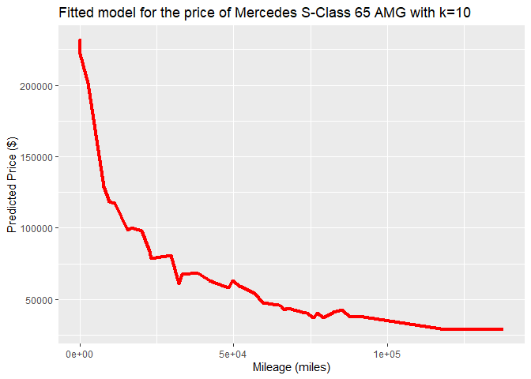

# DataMining\_PS1

## Pranjal Maheshka, Asha Christensen, Marco Navarro

### 2023-01-30

## Question 1 - Data visualization: flights at ABIA

Weekend trips are a very common type of vacation for students or working
professionals– most of which consist of a flight either Thursday or
Friday and a return trip from the same destination Sunday or Monday.

We chose to examine the popularity for these trips by destination and
week of the year in order to find the best combinations to get a
low-demand flight that will likely be cheaper than usual.

The number of flights to a given destination for the given weekend are
assembled by adding the number of flights available departing AUS on
Thursday or Friday and the number of flights available to return to AUS
from that destination the following Sunday or Monday.

The 5 most popular flying destinations to or out of AUS are DAL, DFW,
IAH, PHX, and DEN.

So, let’s look at the weekend flights for these destinations.

This graph shows that Denver is a low-demand location during the winter
months and that Dallas is a popular destination.

However, these destinations are popular due to their proximity to AUS
and due to them being a large hub: I doubt that Dallas lovefield airport
and DFW are most travellers’ final destinations.

Perhaps we can visualize the top tourism destinations in the US instead.
Additionally, we can normalize the number of flights so that we can
focus in relative drops in demand compared to normal– this will reveal
the weekends to get the best “Deals”.

This graph depicts the standardized flights in and out of Austin for
every weekend of the year for the top 8 tourist destinations in the
United States (published on World Atlas, 2019): New York, Miami (no
flights out of AUS), Los Angeles, Orlando, San Francisco, Las Vegas,
Honolulu (No flights out of AUS), and Washington DC.

If we are interested in a vacation this weekend, San Francisco will give
us the best “deal”. If I would like to go to Las Vegas, the end of the
year is the best time to go, as it’s the least-demanded week.

## Question 2 - Wrangling the Olympics

### A) Percentiles of heights for female competitors across all Athletics events

<table>
<thead>
<tr class="header">
<th>Percentiles</th>
<th style="text-align: center;">Height</th>
</tr>
</thead>
<tbody>
<tr class="odd">
<td>5%</td>
<td style="text-align: center;">159</td>
</tr>
<tr class="even">
<td>25%</td>
<td style="text-align: center;">166</td>
</tr>
<tr class="odd">
<td>50%</td>
<td style="text-align: center;">170</td>
</tr>
<tr class="even">
<td>75%</td>
<td style="text-align: center;">175</td>
</tr>
<tr class="odd">
<td>95%</td>
<td style="text-align: center;">183</td>
</tr>
</tbody>
</table>

In order to answer this question, we first filter all the relevant data
(female competitors in all Athletics events) and then apply the quantile
command to construct the previous table. In that table, we can observe
that the 95th percentile of heights for female competitors across all
Athletics events is 183 centimeters.

### B) Variability in competitor’s heights across the entire history of the Olympics

<table>
<thead>
<tr class="header">
<th>Event</th>
<th style="text-align: center;">Standard Deviation</th>
</tr>
</thead>
<tbody>
<tr class="odd">
<td>Rowing Women’s Coxed Fours</td>
<td style="text-align: center;">10.86549</td>
</tr>
<tr class="even">
<td>Basketball Women’s Basketball</td>
<td style="text-align: center;">9.700255</td>
</tr>
<tr class="odd">
<td>Rowing Women’s Coxed Quadruple Sculls</td>
<td style="text-align: center;">9.246396</td>
</tr>
<tr class="even">
<td>Rowing Women’s Coxed Eights</td>
<td style="text-align: center;">8.741931</td>
</tr>
<tr class="odd">
<td>Swimming Women’s 100 metres Butterfly</td>
<td style="text-align: center;">8.134399</td>
</tr>
<tr class="even">
<td>Volleyball Women’s Volleyball</td>
<td style="text-align: center;">8.101521</td>
</tr>
<tr class="odd">
<td>Gymnastics Women’s Uneven Bars</td>
<td style="text-align: center;">8.015942</td>
</tr>
<tr class="even">
<td>Shooting Women’s Double Trap</td>
<td style="text-align: center;">7.826238</td>
</tr>
<tr class="odd">
<td>Cycling Women’s Keirin</td>
<td style="text-align: center;">7.756718</td>
</tr>
<tr class="even">
<td>Swimming Women’s 400 metres Freestyle</td>
<td style="text-align: center;">7.624818</td>
</tr>
</tbody>
</table>

To answer this question, we filter the relevant data (female
competitors) and then group the observations by event. After that, we
calculate the standard deviation for every event, and present the top
ten women’s events with highest standard deviation in height. We can
observe that Swimming Women’s 100 metres Butterfly is the individual
women’s event that had the greatest variability in competitor’s heights
across the entire history of the Olympics.

In case the question is about the event (individual or team) with
greatest variability, the answer is Rowing Women’s Coxed Fours with a
standard deviation of 10.87 centimeters.

### C) Average age of Olympic swimmers

    ## Warning: Ignoring unknown parameters: linewidth

Starting at 18 years old in 1900, the average age swimmers in the
Olympics presented an upward trend during the first period (1900-1912),
reaching its maximum (27 years) in the 1912 Olympics. After that peak,
the trend changed and the average almost continuously fell for the
following 6 decades, reaching 18.5 in the mid-1970s. In most recent
years, an increasing trend was observed again and the average age of
swimmers in Rio de Janeiro 2016 Olympics was 23.2 years old.

In order to compared male and female swimmers trends, we need to mention
that data for female swimmers is available for the 1924 Olympics and
from 1948 to 2016. This situation considerable constraint the comparison
between both groups. From 1948 to 1984, female and male swimmers average
age remained relatively constant around 18 and 20 years, respectively.
After the 1984 Olympics, both series started to present an upward trend.
However, female average age remained relatively constant since 2000
Sidney Olympics. In Rio de Janeiro 2016, female swimmers average age was
22.3 and 24.1 years for male swimmers. In general, both series showed
similar trends in the period that they are comparable and male swimmers
average age was almost always higher than female swimmers average age
(2000 Olympics is the only exception).

## Question 3 - K-Nearest Neighbors Regression for S-Class Cars

The data set contains over 29,000 Mercedes S-Class vehicles. It was
subset down to include price and mileage for the 350 and 65 AMG trim
levels only. The data for each trim level was split in an 80/20 ratio
corresponding to train/test splits.

## Mercedes S-Class 350

The RMSE values for the 350 trim usually range from 9,500 to 12,500 for
k-values from 2-80. The lowest RMSE has a different k-value for each
iteration of code because of the randomized train/test splits. The
k-value associated with the lowest RMSE value ranged from 8 to 73. Given
the general shape of the RMSE-k plot, and in order to find a balance
between a low RMSE and a smoother prediction curve - the k-value chosen
for the model is 20.

Below is a plot of the fitted model, i.e. predictions vs price. At k=20
there is lesser variation in the curve (less wiggly) than a lower
k-value while having a relatively low RMSE.

## Mercedes S-Class 65 AMG

The RMSE values for the 65 AMG trim usually range from 15,000 to 32,000
for k-values from 2-80. The lowest RMSE has a different k-value for each
iteration of code because of the randomized train/test splits. The
k-value associated with the lowest RMSE value ranged from 3 to 36. Given
the general shape of the RMSE-k plot, and in order to find a balance
between a low RMSE and a smoother prediction curve - the k-value chosen
for the model is 10.

Below is a plot of the fitted model, i.e. predictions vs price. At k=10
there is lesser variation in the curve (less wiggly) than a lower
k-value while having a relatively low RMSE.

The 350 trim has data points ranging from $6,600 to 106,010 while the 65
AMG trim has data points ranging from $18,990 to $247,075 and there is
significantly more variation in the data for the 65 AMG than the 350.
The RMSE values are consistently much higher for the 65 AMG than the
350. The variation in the data can be attributed to the fact that the 65
AMG is an ultra-premium luxury sports car while the 350 is a luxury
sedan that sees a much wider audience and much higher sales globally.
The exact condition of the 65 AMG and potential sub-trims or add-ons
could affect resale price greatly relative to the 350. In other words,
more parameters would help create a better predictive model for the 65
AMG. The 350 is a sedan that has fewer options and fewer overall
variations. Sports car enthusiasts are likely more discerning about the
condition of the car and care more about different subtle aspects than
the average sedan buyer who might use the 350 as a daily car.

Accordingly, the 350 trim sees higher k-values with lower RMSE values
thus resulting in the final pick of k=20. Given the greater variation in
price vs mileage for the 65 AMG, lower k-values consistently were
associated with the minimum RMSE value and accordingly k=10 was chosen
for the 350 trim and k=20 was chosen for the 65 AMG trim.

## R Markdown

This is an R Markdown document. Markdown is a simple formatting syntax
for authoring HTML, PDF, and MS Word documents. For more details on
using R Markdown see <http://rmarkdown.rstudio.com>.

When you click the **Knit** button a document will be generated that
includes both content as well as the output of any embedded R code
chunks within the document. You can embed an R code chunk like this:

    summary(cars)

    ##      speed           dist       
    ##  Min.   : 4.0   Min.   :  2.00  
    ##  1st Qu.:12.0   1st Qu.: 26.00  
    ##  Median :15.0   Median : 36.00  
    ##  Mean   :15.4   Mean   : 42.98  
    ##  3rd Qu.:19.0   3rd Qu.: 56.00  
    ##  Max.   :25.0   Max.   :120.00

## Including Plots

You can also embed plots, for example:

Note that the `echo = FALSE` parameter was added to the code chunk to
prevent printing of the R code that generated the plot.
