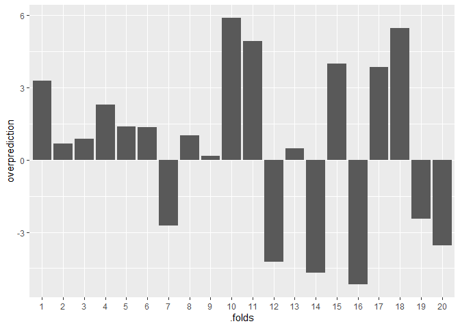

# DataMining\_PS2

## Pranjal Maheshka, Asha Christensen, Marco Navarro

### 2023-01-30

## Question 1: Saratoga house prices

The house price prediction exercise has been carried out using data on
1728 houses in Saratoga County, New York, USA in 2006. In addition to
price, this dataset contains 15 variables that capture different
characteristics of these houses, such as size of lot (acres), value of
land (US dollars), living area (square feet), etc.

### Price prediction strategy

The following two methods were tested in the building process of a
prediction model of house prices:

-   Linear model: This approach try to estimate coefficients for the
    following linear model

*p**r**i**c**e* = *β*0 + *β*1*x*1 + .... + *β*1*x**p* + *u*

where (*x*1,...,*x**p*) are houses features plus
transformations and interactions of this features.

-   K-nearest neighbors regression: In this method, given a value for K
    and a set of values for the features
    (*x*1\*,...,*x**p*\*) , KNN regression first
    identifies the K training observations that are closest to
    (*x*1\*,...,*x**p*\*) and then estimates the
    predicted price using the average of those K closest prices.

More details about the estimated models can be found in the Appendix.

### Model evaluation

The k-fold cross validation is the procedure used to evaluate the
out-of-sample performance of the models. This is a resampling method
that uses different portions of the data to test and train a model on
different iterations. The whole dataset was split into 5 different folds
to perform this evaluation and the accuracy of the prediction was
evaluated by checking the root mean square error (RMSE).

### Results

Among the K-nearest neighbors regressions, the k-value associated with
the lowest cross-validated error (mean of the Root Mean Squared Error)
is k=10. The cross-validated error for k=10 is $61,010 with a standard
error of 1,384 dollars.

That last result compares poorly against the cross-validated error of
the best linear model. In the case of this linear model, the cross
validated error is $57,068 with a standard error of 1,903 dollars.

In conclusion, the results have shown that the linear model has the best
performance among these two methods according to the k-fold cross
validation. Given this particular set of explanatory variables, the
prediction model should be the linear model. The following table
presents the results of the evaluations.

<table style="width:100%;">
<colgroup>
<col style="width: 23%" />
<col style="width: 11%" />
<col style="width: 11%" />
<col style="width: 11%" />
<col style="width: 11%" />
<col style="width: 11%" />
<col style="width: 11%" />
<col style="width: 9%" />
</colgroup>
<thead>
<tr class="header">
<th>Model</th>
<th style="text-align: center;">RMSE_1</th>
<th style="text-align: center;">RMSE_2</th>
<th style="text-align: center;">RMSE_3</th>
<th style="text-align: center;">RMSE_4</th>
<th style="text-align: center;">RMSE_5</th>
<th style="text-align: center;">Mean</th>
<th style="text-align: center;">Sd Dev</th>
</tr>
</thead>
<tbody>
<tr class="odd">
<td>Best Linear Model</td>
<td style="text-align: center;">56171.2</td>
<td style="text-align: center;">55058.87</td>
<td style="text-align: center;">52071.68</td>
<td style="text-align: center;">63409.28</td>
<td style="text-align: center;">58631.75</td>
<td style="text-align: center;">57068.56</td>
<td style="text-align: center;">1903.43</td>
</tr>
<tr class="even">
<td>KNN k=10</td>
<td style="text-align: center;">63348.51</td>
<td style="text-align: center;">60654.92</td>
<td style="text-align: center;">63415.53</td>
<td style="text-align: center;">55872.56</td>
<td style="text-align: center;">61762.50</td>
<td style="text-align: center;">61010.80</td>
<td style="text-align: center;">1384.57</td>
</tr>
</tbody>
</table>

The accuracy of this two methods can be reevaluated after an expansion
of the number of observations or number of explanatory variables.

## Question 2: German Credit Defaults

The data here deals with loan defaults from a German bank. The “Default”
variable is binary with 1 indicating that loan fell into default during
some point. Other variables are characteristics associated with the loan
and the borrower, the primary of which is under consideration is the
credit history variable. Credit history can be good, poor, or terrible.

## Credit History

Below is a bar plot showing default probability by a borrower’s credit
history rating. This is a very interesting plot because it seems that
“good” borrowers have a 60% chance of default while terrible borrowers
only have a 17% chance of default. This is misleading information as it
does not encompass all the loans given out by the German and this will
be discussed next.

    ## 
    ## Call:  glm(formula = Default ~ duration + amount + installment + age + 
    ##     history + purpose + foreign, family = "binomial", data = credit)
    ## 
    ## Coefficients:
    ##         (Intercept)             duration               amount  
    ##          -7.075e-01            2.526e-02            9.596e-05  
    ##         installment                  age          historypoor  
    ##           2.216e-01           -2.018e-02           -1.108e+00  
    ##     historyterrible           purposeedu  purposegoods/repair  
    ##          -1.885e+00            7.248e-01            1.049e-01  
    ##       purposenewcar       purposeusedcar        foreigngerman  
    ##           8.545e-01           -7.959e-01           -1.265e+00  
    ## 
    ## Degrees of Freedom: 999 Total (i.e. Null);  988 Residual
    ## Null Deviance:       1222 
    ## Residual Deviance: 1070  AIC: 1094

## Logit Regression

A logit regression (shown above) on default was run using the variables
duration, amount, installment, age, history, purpose, foreign. For the
credit history variable, the “good” rating is the default (indicated by
the intercept) which means that the coefficient of -1.108 for a “poor”
history and a -1.885 for a “terrible” history are surprising results at
first glance. This means that borrowers with a poor history are 67.0%
less likely to default than borrowers with a good history. Terrible
credit histories are actually predicted to be 84.8% less likely to
default. These results are in stark contrast to what one might expect.
Normally, borrowers with a better credit history are more likely to
receive a loan at a lower interest rate and more likely to pay it back
on time.

This data was considered and collected in a retrospective, case-control
design manner. This means that it conditioned on defaults implicitly
given that 30% of the observations show Default = 1 and the other
observations were picked to match similar sets of non-defaulting loans
to the defaulted loans. This was not a random selection of the
population of data available to the bank, the data were chosen with a
strong selection bias. Given that good ratings are more likely to
approved for loans than terrible ratings, there is bias in selection.
Individuals with terrible ratings might have other factors that lend to
their credibility that allow them to get approved on a more selective,
stringent basis. It is possible then that they have the same rates of
default in the overall sample. It is also possible that there are fewer
other non-defaulting borrowers to compare them against making their
default rate in this sample just 17%. Defaulting good rating borrowers
might have more comparable non-defaulting borrowers so this sample skews
the data to show a 60% default rate. We will not know the exact cause of
the skew in data because the exact data selection and sub-sampling
method is unknown here.

This is data is not appropriate for building a predictive model because
it is not representative of the population. This is true for many
reasons listed above like the default rates for different credit
histories but also because it is not possible that bank sees a 30%
default rate overall. The bank can either consider the entire population
of data it has and then create a train/test split before creating a
predictive model or it randomly sample the data such the dataset is
smaller and perhaps easier to train the model on. The important thing is
that the sample should be randomized and free of selection bias such
that it is representative of the true population.

Note: The interpretation of the logit model was done as follows: A
negative coefficient can be converted to a probability percentage using
the formula: 1 - (e^coef).

## Question 3: Children and Hotel Reservations

### Model Building

Model 1:

    ## 
    ## Call:
    ## lm(formula = children ~ market_segment + adults + customer_type + 
    ##     is_repeated_guest, data = dev_train)
    ## 
    ## Residuals:
    ##      Min       1Q   Median       3Q      Max 
    ## -0.18179 -0.11342 -0.09599 -0.02705  1.03251 
    ## 
    ## Coefficients:
    ##                               Estimate Std. Error t value Pr(>|t|)    
    ## (Intercept)                  -0.018320   0.028773  -0.637  0.52433    
    ## market_segmentComplementary   0.086795   0.031368   2.767  0.00566 ** 
    ## market_segmentCorporate       0.012659   0.028057   0.451  0.65185    
    ## market_segmentDirect          0.113462   0.027812   4.080 4.52e-05 ***
    ## market_segmentGroups          0.005345   0.028149   0.190  0.84939    
    ## market_segmentOffline_TA/TO   0.020171   0.027794   0.726  0.46801    
    ## market_segmentOnline_TA       0.079954   0.027680   2.889  0.00387 ** 
    ## adults                        0.017431   0.003005   5.800 6.68e-09 ***
    ## customer_typeGroup           -0.010342   0.018676  -0.554  0.57975    
    ## customer_typeTransient        0.016922   0.007874   2.149  0.03163 *  
    ## customer_typeTransient-Party -0.009666   0.008350  -1.158  0.24704    
    ## is_repeated_guest            -0.044728   0.007714  -5.798 6.77e-09 ***
    ## ---
    ## Signif. codes:  0 '***' 0.001 '**' 0.01 '*' 0.05 '.' 0.1 ' ' 1
    ## 
    ## Residual standard error: 0.2697 on 35988 degrees of freedom
    ## Multiple R-squared:  0.03117,    Adjusted R-squared:  0.03087 
    ## F-statistic: 105.3 on 11 and 35988 DF,  p-value: < 2.2e-16

Model 2:

    ## 
    ## Call:
    ## lm(formula = children ~ . - arrival_date, data = dev_train)
    ## 
    ## Residuals:
    ##      Min       1Q   Median       3Q      Max 
    ## -0.95970 -0.08422 -0.03860  0.00883  1.08383 
    ## 
    ## Coefficients:
    ##                                      Estimate Std. Error t value Pr(>|t|)    
    ## (Intercept)                        -5.490e-02  2.537e-02  -2.164  0.03050 *  
    ## hotelResort_Hotel                  -3.308e-02  3.237e-03 -10.221  < 2e-16 ***
    ## lead_time                           4.038e-05  1.613e-05   2.503  0.01232 *  
    ## stays_in_weekend_nights             3.345e-03  1.478e-03   2.263  0.02363 *  
    ## stays_in_week_nights               -8.037e-04  8.021e-04  -1.002  0.31634    
    ## adults                             -3.780e-02  2.834e-03 -13.335  < 2e-16 ***
    ## mealFB                              4.266e-02  1.955e-02   2.183  0.02906 *  
    ## mealHB                             -1.219e-04  4.139e-03  -0.029  0.97651    
    ## mealSC                             -5.282e-02  4.778e-03 -11.054  < 2e-16 ***
    ## mealUndefined                       1.588e-02  1.227e-02   1.294  0.19564    
    ## market_segmentComplementary         4.855e-02  2.922e-02   1.661  0.09664 .  
    ## market_segmentCorporate             4.404e-02  2.456e-02   1.793  0.07300 .  
    ## market_segmentDirect                4.036e-02  2.662e-02   1.516  0.12950    
    ## market_segmentGroups                5.339e-02  2.583e-02   2.067  0.03873 *  
    ## market_segmentOffline_TA/TO         6.629e-02  2.592e-02   2.558  0.01053 *  
    ## market_segmentOnline_TA             6.129e-02  2.585e-02   2.371  0.01776 *  
    ## distribution_channelDirect          2.268e-02  1.143e-02   1.984  0.04724 *  
    ## distribution_channelGDS            -7.564e-02  2.778e-02  -2.723  0.00647 ** 
    ## distribution_channelTA/TO           2.600e-03  9.584e-03   0.271  0.78619    
    ## is_repeated_guest                  -3.294e-02  7.292e-03  -4.517 6.29e-06 ***
    ## previous_cancellations              9.400e-04  5.332e-03   0.176  0.86006    
    ## previous_bookings_not_canceled     -2.133e-03  8.909e-04  -2.394  0.01668 *  
    ## reserved_room_typeB                 2.243e-01  1.531e-02  14.654  < 2e-16 ***
    ## reserved_room_typeC                 5.426e-01  1.617e-02  33.557  < 2e-16 ***
    ## reserved_room_typeD                -6.825e-02  4.839e-03 -14.103  < 2e-16 ***
    ## reserved_room_typeE                -1.983e-02  8.671e-03  -2.287  0.02218 *  
    ## reserved_room_typeF                 3.074e-01  1.290e-02  23.836  < 2e-16 ***
    ## reserved_room_typeG                 4.295e-01  1.735e-02  24.755  < 2e-16 ***
    ## reserved_room_typeH                 5.758e-01  3.212e-02  17.927  < 2e-16 ***
    ## reserved_room_typeL                -8.531e-02  1.658e-01  -0.515  0.60688    
    ## assigned_room_typeB                 7.603e-03  1.024e-02   0.743  0.45777    
    ## assigned_room_typeC                 9.712e-02  9.332e-03  10.408  < 2e-16 ***
    ## assigned_room_typeD                 5.853e-02  4.202e-03  13.929  < 2e-16 ***
    ## assigned_room_typeE                 4.901e-02  7.726e-03   6.344 2.27e-10 ***
    ## assigned_room_typeF                 6.054e-02  1.111e-02   5.451 5.03e-08 ***
    ## assigned_room_typeG                 8.352e-02  1.517e-02   5.505 3.71e-08 ***
    ## assigned_room_typeH                 8.013e-02  2.793e-02   2.869  0.00412 ** 
    ## assigned_room_typeI                 9.509e-02  1.867e-02   5.093 3.54e-07 ***
    ## assigned_room_typeK                 3.458e-02  2.080e-02   1.663  0.09634 .  
    ## booking_changes                     2.040e-02  1.729e-03  11.798  < 2e-16 ***
    ## deposit_typeNon_Refund              2.925e-02  3.444e-02   0.849  0.39568    
    ## deposit_typeRefundable              2.176e-02  2.859e-02   0.761  0.44657    
    ## days_in_waiting_list               -4.074e-05  8.842e-05  -0.461  0.64497    
    ## customer_typeGroup                 -8.256e-04  1.632e-02  -0.051  0.95966    
    ## customer_typeTransient              1.062e-02  6.971e-03   1.524  0.12763    
    ## customer_typeTransient-Party       -3.067e-02  7.531e-03  -4.073 4.66e-05 ***
    ## average_daily_rate                  8.997e-04  3.311e-05  27.174  < 2e-16 ***
    ## required_car_parking_spacesparking -3.418e-03  4.350e-03  -0.786  0.43197    
    ## total_of_special_requests           3.254e-02  1.681e-03  19.358  < 2e-16 ***
    ## ---
    ## Signif. codes:  0 '***' 0.001 '**' 0.01 '*' 0.05 '.' 0.1 ' ' 1
    ## 
    ## Residual standard error: 0.2343 on 35951 degrees of freedom
    ## Multiple R-squared:   0.27,  Adjusted R-squared:  0.269 
    ## F-statistic:   277 on 48 and 35951 DF,  p-value: < 2.2e-16

Model 3:

    ## 
    ## Call:
    ## lm(formula = children ~ adults + adults2 + hotel + reserved_room_type + 
    ##     hotel:reserved_room_type + adults2:reserved_room_type + adults:reserved_room_type + 
    ##     adults2:hotel, data = dev_train)
    ## 
    ## Residuals:
    ##      Min       1Q   Median       3Q      Max 
    ## -0.96023 -0.06146 -0.05732 -0.01633  1.04497 
    ## 
    ## Coefficients: (3 not defined because of singularities)
    ##                                        Estimate Std. Error t value Pr(>|t|)    
    ## (Intercept)                            0.020332   0.006656   3.055 0.002255 ** 
    ## adults                                -0.007566   0.005229  -1.447 0.147967    
    ## adults2                                0.056261   0.005989   9.394  < 2e-16 ***
    ## hotelResort_Hotel                      0.003560   0.005159   0.690 0.490182    
    ## reserved_room_typeB                    0.939902   0.028993  32.418  < 2e-16 ***
    ## reserved_room_typeC                    0.082548   0.162969   0.507 0.612492    
    ## reserved_room_typeD                    0.041935   0.015547   2.697 0.006992 ** 
    ## reserved_room_typeE                    0.155690   0.026223   5.937 2.93e-09 ***
    ## reserved_room_typeF                    0.952764   0.051300  18.573  < 2e-16 ***
    ## reserved_room_typeG                   -0.054243   0.057311  -0.946 0.343918    
    ## reserved_room_typeH                    0.510782   0.144640   3.531 0.000414 ***
    ## reserved_room_typeL                   -0.016326   0.228887  -0.071 0.943138    
    ## hotelResort_Hotel:reserved_room_typeB -0.105444   0.229325  -0.460 0.645661    
    ## hotelResort_Hotel:reserved_room_typeC  0.765800   0.180846   4.235 2.30e-05 ***
    ## hotelResort_Hotel:reserved_room_typeD -0.004173   0.007014  -0.595 0.551929    
    ## hotelResort_Hotel:reserved_room_typeE -0.218888   0.013029 -16.800  < 2e-16 ***
    ## hotelResort_Hotel:reserved_room_typeF -0.740959   0.015256 -48.567  < 2e-16 ***
    ## hotelResort_Hotel:reserved_room_typeG -0.001458   0.020785  -0.070 0.944059    
    ## hotelResort_Hotel:reserved_room_typeH        NA         NA      NA       NA    
    ## hotelResort_Hotel:reserved_room_typeL        NA         NA      NA       NA    
    ## adults2:reserved_room_typeB           -0.104233   0.065924  -1.581 0.113862    
    ## adults2:reserved_room_typeC            0.290409   0.041994   6.915 4.74e-12 ***
    ## adults2:reserved_room_typeD           -0.004811   0.008961  -0.537 0.591380    
    ## adults2:reserved_room_typeE            0.069801   0.015050   4.638 3.53e-06 ***
    ## adults2:reserved_room_typeF            0.217837   0.023763   9.167  < 2e-16 ***
    ## adults2:reserved_room_typeG            0.369216   0.026044  14.177  < 2e-16 ***
    ## adults2:reserved_room_typeH           -0.056747   0.059351  -0.956 0.339011    
    ## adults2:reserved_room_typeL           -0.032469   0.323678  -0.100 0.920097    
    ## adults:reserved_room_typeB            -0.389510   0.037080 -10.505  < 2e-16 ***
    ## adults:reserved_room_typeC            -0.198193   0.036675  -5.404 6.56e-08 ***
    ## adults:reserved_room_typeD            -0.012214   0.007785  -1.569 0.116673    
    ## adults:reserved_room_typeE             0.001907   0.012726   0.150 0.880907    
    ## adults:reserved_room_typeF            -0.186579   0.021957  -8.497  < 2e-16 ***
    ## adults:reserved_room_typeG             0.156202   0.022024   7.092 1.34e-12 ***
    ## adults:reserved_room_typeH             0.084300   0.048013   1.756 0.079138 .  
    ## adults:reserved_room_typeL                   NA         NA      NA       NA    
    ## adults2:hotelResort_Hotel             -0.016226   0.005990  -2.709 0.006751 ** 
    ## ---
    ## Signif. codes:  0 '***' 0.001 '**' 0.01 '*' 0.05 '.' 0.1 ' ' 1
    ## 
    ## Residual standard error: 0.2288 on 35966 degrees of freedom
    ## Multiple R-squared:  0.303,  Adjusted R-squared:  0.3024 
    ## F-statistic: 473.8 on 33 and 35966 DF,  p-value: < 2.2e-16

The third model used engineered features: a new dummy-variable was
created, “adults2” when adults==2. Having 2 adults on the reservation
would seemingly increase the probability of children being on the
reservation, so we tested including this feature.

Then, we started with a medium model, including adults, adults2, hotel
type and the type of room reserved. A step-wise selection model was
created allowing for 2-way interaction terms between the prexisting
variables in the medium model.

Let’s evaluate all three of these models for out-of-sample performance
using the testing split from hotels\_dev:

    ## [1] 0.262462

    ## [1] 0.2285354

    ## [1] 0.2231526

Baseline model 3 has the lowest rmse.

### Model Validation, Step 1

### Model Validation, Step 2

Our prediction model from the step-wise approach accurately guesses the
number of bookings with children within a small margin of error. The
actual margins depend on the k-fold splits, but inaccuracy is almost
always less than 5-6 bookings. Given that these are groups of 250
bookings, this is a relatively small margin of error– especially
considering that the majority of bookings are less than 1 booking off
from estimating the number of bookings with children.

## Appendix - Question 1

### Saratoga house prices

#### The dataset

The house prices dataset data has 1728 observations on the following 16
variables.

-   `price` price (US dollars)
-   `lotSize` size of lot (acres)
-   `age` age of house (years)
-   `landValue` value of land (US dollars)
-   `livingArea` living are (square feet)
-   `pctCollege` percent of neighborhood that graduated college
-   `bedrooms` number of bedrooms
-   `fireplaces` number of fireplaces
-   `bathrooms` number of bathrooms (half bathrooms have no shower or
    tub)
-   `rooms` number of rooms
-   `heating` type of heating system
-   `fuel` fuel used for heating
-   `sewer` type of sewer system
-   `waterfront` whether property includes waterfront
-   `newConstruction` whether the property is a new construction
-   `centralAir` whether the house has central air

Additionally, these variables were created:

-   `age2` whether or not the house its older than 40 years.
-   `bedrooms2` whether or not the house has more than 4 bedrooms.

#### Linear model regression

The linear models were estimated using transformations, polynomial
terms, and interactions of the original house features. After comparing
different specifications of the linear model, the best model was chosen
as the one with lowest cross-validated errors. The best linear model has
43 coefficients and the following table presents the estimated
coefficients for this model.

<table>
<colgroup>
<col style="width: 50%" />
<col style="width: 50%" />
</colgroup>
<tbody>
<tr class="odd">
<td style="text-align: center;">(Intercept)</td>
<td style="text-align: center;">lotSize</td>
</tr>
<tr class="even">
<td style="text-align: center;">1.339703e+05</td>
<td style="text-align: center;">-2.434482e+03</td>
</tr>
<tr class="odd">
<td style="text-align: center;">bedrooms</td>
<td style="text-align: center;">fuelelectric</td>
</tr>
<tr class="even">
<td style="text-align: center;">5.579980e+03</td>
<td style="text-align: center;">-2.523318e+04</td>
</tr>
<tr class="odd">
<td style="text-align: center;">fueloil</td>
<td style="text-align: center;">newConstructionNo</td>
</tr>
<tr class="even">
<td style="text-align: center;">3.914479e+04</td>
<td style="text-align: center;">3.214339e+04</td>
</tr>
<tr class="odd">
<td style="text-align: center;">centralAirNo</td>
<td style="text-align: center;">waterfrontNo</td>
</tr>
<tr class="even">
<td style="text-align: center;">-1.349244e+04</td>
<td style="text-align: center;">-9.738634e+04</td>
</tr>
<tr class="odd">
<td style="text-align: center;">rooms</td>
<td style="text-align: center;">fireplaces</td>
</tr>
<tr class="even">
<td style="text-align: center;">2.470676e+03</td>
<td style="text-align: center;">1.892046e+04</td>
</tr>
<tr class="odd">
<td style="text-align: center;">livingArea</td>
<td style="text-align: center;">pctCollege</td>
</tr>
<tr class="even">
<td style="text-align: center;">5.868298e+01</td>
<td style="text-align: center;">-4.862284e+02</td>
</tr>
<tr class="odd">
<td style="text-align: center;">age</td>
<td style="text-align: center;">bathrooms</td>
</tr>
<tr class="even">
<td style="text-align: center;">-2.081983e+03</td>
<td style="text-align: center;">1.363895e+04</td>
</tr>
<tr class="odd">
<td style="text-align: center;">heatinghot water/steam</td>
<td style="text-align: center;">heatingelectric</td>
</tr>
<tr class="even">
<td style="text-align: center;">2.707111e+04</td>
<td style="text-align: center;">6.345186e+03</td>
</tr>
<tr class="odd">
<td style="text-align: center;">age2</td>
<td style="text-align: center;">I(age^2)</td>
</tr>
<tr class="even">
<td style="text-align: center;">-3.882054e+04</td>
<td style="text-align: center;">-2.508183e+00</td>
</tr>
<tr class="odd">
<td style="text-align: center;">lotSize:bedrooms</td>
<td style="text-align: center;">lotSize:fuelelectric</td>
</tr>
<tr class="even">
<td style="text-align: center;">4.384200e+03</td>
<td style="text-align: center;">6.889665e+03</td>
</tr>
<tr class="odd">
<td style="text-align: center;">lotSize:fueloil</td>
<td style="text-align: center;">bedrooms:fuelelectric</td>
</tr>
<tr class="even">
<td style="text-align: center;">-2.395283e+03</td>
<td style="text-align: center;">6.277175e+03</td>
</tr>
<tr class="odd">
<td style="text-align: center;">bedrooms:fueloil</td>
<td style="text-align: center;">rooms:livingArea</td>
</tr>
<tr class="even">
<td style="text-align: center;">-1.274805e+04</td>
<td style="text-align: center;">1.764660e+00</td>
</tr>
<tr class="odd">
<td style="text-align: center;">bedrooms:rooms</td>
<td style="text-align: center;">fireplaces:landValue</td>
</tr>
<tr class="even">
<td style="text-align: center;">-1.181118e+03</td>
<td style="text-align: center;">-2.466258e-01</td>
</tr>
<tr class="odd">
<td style="text-align: center;">livingArea:fireplaces</td>
<td style="text-align: center;">fireplaces:pctCollege</td>
</tr>
<tr class="even">
<td style="text-align: center;">1.529200e+01</td>
<td style="text-align: center;">-5.747540e+02</td>
</tr>
<tr class="odd">
<td style="text-align: center;">livingArea:landValue</td>
<td style="text-align: center;">livingArea:heatinghot water/steam</td>
</tr>
<tr class="even">
<td style="text-align: center;">-2.689740e-04</td>
<td style="text-align: center;">-1.917907e+01</td>
</tr>
<tr class="odd">
<td style="text-align: center;">livingArea:heatingelectric</td>
<td style="text-align: center;">landValue:pctCollege</td>
</tr>
<tr class="even">
<td style="text-align: center;">-1.232713e+01</td>
<td style="text-align: center;">1.334857e-02</td>
</tr>
<tr class="odd">
<td style="text-align: center;">pctCollege:age</td>
<td style="text-align: center;">age:sewerpublic/commercial</td>
</tr>
<tr class="even">
<td style="text-align: center;">1.427984e+01</td>
<td style="text-align: center;">3.632516e+02</td>
</tr>
<tr class="odd">
<td style="text-align: center;">age:sewernone</td>
<td style="text-align: center;">landValue:bathrooms</td>
</tr>
<tr class="even">
<td style="text-align: center;">3.994448e+03</td>
<td style="text-align: center;">2.855780e-01</td>
</tr>
<tr class="odd">
<td style="text-align: center;">sewerpublic/commercial:bathrooms</td>
<td style="text-align: center;">sewernone:bathrooms</td>
</tr>
<tr class="even">
<td style="text-align: center;">-4.912088e+03</td>
<td style="text-align: center;">-1.701781e+04</td>
</tr>
<tr class="odd">
<td style="text-align: center;">age:age2</td>
<td style="text-align: center;">lotSize:landValue</td>
</tr>
<tr class="even">
<td style="text-align: center;">1.546965e+03</td>
<td style="text-align: center;">-1.263039e-01</td>
</tr>
<tr class="odd">
<td style="text-align: center;">centralAirNo:heatinghot water/steam</td>
<td style="text-align: center;">centralAirNo:heatingelectric</td>
</tr>
<tr class="even">
<td style="text-align: center;">1.796120e+03</td>
<td style="text-align: center;">1.767431e+04</td>
</tr>
<tr class="odd">
<td style="text-align: center;">newConstructionNo:landValue</td>
<td style="text-align: center;"></td>
</tr>
<tr class="even">
<td style="text-align: center;">3.866956e-01</td>
<td style="text-align: center;"></td>
</tr>
</tbody>
</table>

#### K-nearest neighbors regression

Before running the KNN regression, all continuous variables, such as
landValue or lotSize, were standardize. In addition, the categorical
variables, such as heating or sewer, were split in a series of
dichotomous variables for each category. After this transformations to
the dataset, the KNN regression considered the following different
values of K: 2, 4, 6, 8, 10, 12, 15,17, 20,22, 25,27, 30, 35, 40, 45,50,
60, 70, 80, 90, 100. Among these values, K=10 was chosen because it was
associated with the minimum cross-validated errors.

