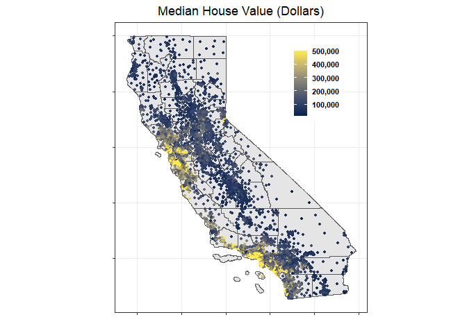
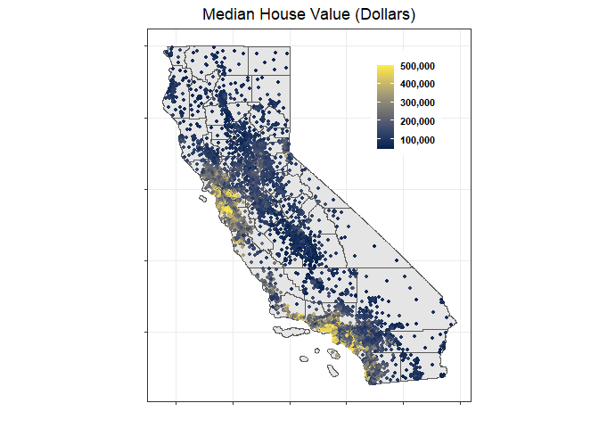

## Question 4 Predictive model building: California housing

The median house value at the census tract level prediction exercise has
been carried out using data on 20,640 census tracts in the state of
California. In addition to median house value, this dataset contains 8
variables that capture different characteristics of the census tracks
and their houses, such as population, number of households, median age
in years of all residential households, total of bedrooms, etc.

### Median house value prediction strategy

Four different methods were tested in the building process of a
prediction model of house prices: linear model, K-nearest neighbors
regression, regression tree and random forests.

For the K-nearest neighbors regression method, different values of K
were evaluated and we picked the one with the the minimum root mean
square error (RMSE) after k-fold cross validation. On the other hand,
recursive partitioning was applied to generate a sequence of trees and
select the regression tree with the minimum cross-validated error.

### Model evaluation of the different methods and results

The k-fold cross validation is the procedure used to evaluate the
out-of-sample performance of the linear model, the K-nearest neighbors
regression and the regression tree. This is a resampling method that
uses different portions of the data to test and train a model on
different iterations. The whole dataset was split into 10 different
folds to perform this evaluation and the accuracy of the prediction was
evaluated by checking the root mean square error (RMSE).

Among these three different methods, the tree regression model presents
the best out-of-sample performance. The cross validated error for this
tree model equals 59,621.

In the case of the random forest, due to the estimation process, we
already have a measure of the out-of-sample performance with the
“out-of-bag” predictions. However, We split our our observations in a
training and test set in order to have a comparable out of sample error.
Using this entirely fresh subset of the data, the root mean squared
error on the test set equals 50,520.

In conclusion, the results have shown that the random forest model has
the best performance among these methods. Given this particular set of
explanatory variables, the prediction model should be the random forest.

The accuracy of these methods can be reevaluated after an expansion of
the number of observations or number of explanatory variables.

## Original values

## Predicted Values

## Model’s errors

