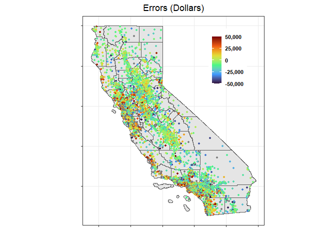

## Question 1: What Causes What?

1.  Cities with high levels of crime are incentivized to hire more cops:
    this means that even if cops deter crime, regressing “crime” on
    “police” may give an opposite result, since crime and police are
    positively correlated. Therefore, we need to use a different method
    to find the true effect of police on crime.

2.  They found times in which there was a high police presence on the
    street which was not due to street crime: the terror alert level
    being orange or red. When this is the case, there is an extra police
    presence that is due to terrorism but not due to the type of crime
    they wanted to study. In this way, they could look at the effect of
    increased police presence on these days on street crime rates.

The table shows that high alert terrorism days decreased the number of
daily crimes by 7.316 crimes, and this effect was still large and
significant after controlling for metro mid-day ridership.

1.  There are 2 potential effects of a high terrorism alert (i) there is
    an increased police presence on the street, (ii) the terrorism
    threat reduces tourism and therefore potential victims on the
    street. Both of these could reduce the daily crime rate, so in order
    to isolate the first effect, we need to control for the third.
    Therefore, they use Metro mid-day ridership as an indicator of the
    number of people out-and-about. Controlling for this should isolate
    the effect of increased police presence on daily crime rates.

2.  When we separate out crimes that occur in the national mall versus
    the rest of the city, we find that the reduction in crime due to
    high alert days primarily takes place in the national mall– this may
    be due to the fact that the majority of increased police presence
    during a terrorism alert is concentrated on the national mall since
    these are the most likely terrorism threats. The decrease in crimes
    for the rest of the city is not statistically significant, whereas
    the reduction in crimes in the national mall is 2.62 crimes.

## Question 3 Predictive model building: green certification

Let’s start with some step-wise models, using some medium linear models.
Here are our initial out-of-sample RMSEs for both linear models:

    ## [1] 979.7368

    ## [1] 1357.384

In these step-wise regressions, we allow the use of all variables except
rent, leasing rate, property ID, LEED and Energystar, allowing for
second-level interactions.

    ## [1] 967.8153

    ## [1] 1291.632

There’s a slight improvement on out-of-sample RMSE, but not a large
decrease. We may be able to use a random forest model to more accurately
predict revenue per square foot per year.

    ## [1] 409.1368

Our out-of-sample RMSE is much lower than the linear step models
produced, so this is our best model to predict revenue per square foot
per year. We can now look at the partial effect of green rating.

According to the variable importance plot, this indicates that green
rating is not one of the more important variables in predicting revenue
per square foot per year.

We use our testing set to look at the partial effect of green rating.
Green rating is a binary variable: we can see in the graph that being
rated green is associated with an increase of roughly $80 in revenue per
square foot per year. We can look to see if this partial effect is
impacted by interaction with other relevant terms: Gas Costs,
Electricity Costs and Size of the building.

We can see that there is not a large partial effect of green rating
among buildings that are the same size: this may indicate that our
original $80 of increased revenue may be due to a confounder. Perhaps
large buildings are more likely to be rated green and also more likely
to have increased revenue per square foot per year. Additionally, there
is little to no effect of being rated green if energy costs such as
electricity are sufficiently low.

## Question 4 Predictive model building: California housing

The median house value at the census tract level prediction exercise has
been carried out using data on 20,640 census tracts in the state of
California. In addition to median house value, this dataset contains 8
variables that capture different characteristics of the census tracks
and their houses, such as population, number of households, median age
in years of all residential households, total of bedrooms, etc.

### Median house value prediction strategy

Four different methods were tested in the building process of a
prediction model of house prices: linear model, K-nearest neighbors
regression, regression tree and random forests.

For the K-nearest neighbors regression method, different values of K
were evaluated and we picked the one with the the minimum root mean
square error (RMSE) after k-fold cross validation. On the other hand,
recursive partitioning was applied to generate a sequence of trees and
select the regression tree with the minimum cross-validated error.

### Model evaluation of the different methods and results

The k-fold cross validation is the procedure used to evaluate the
out-of-sample performance of the linear model, the K-nearest neighbors
regression and the regression tree. This is a resampling method that
uses different portions of the data to test and train a model on
different iterations. The whole dataset was split into 10 different
folds to perform this evaluation and the accuracy of the prediction was
evaluated by checking the root mean square error (RMSE).

Among these three different methods, the tree regression model presents
the best out-of-sample performance. The cross validated error for this
tree model equals 59,621.

In the case of the random forest, due to the estimation process, we
already have a measure of the out-of-sample performance with the
“out-of-bag” predictions. However, we split our observations in a
training and test set in order to have a comparable out of sample error.
Using this entirely fresh subset of the data, the root mean squared
error on the test set equals 50,520.

In conclusion, the results have shown that the random forest model has
the best performance among these methods. Given this particular set of
explanatory variables, the prediction model should be the random forest.

The accuracy of these methods can be reevaluated after an expansion of
the number of observations or number of explanatory variables.

After selecting the best model, we proceed to present graphs of the
original values, random forest predicted values and random forest
model’s error.

## Original values

## Predicted Values

## Model’s errors (Original values - Predicted values)

In the error graph, grey points correspond to those errors that are
higher than 50,000 or lower than -50,000.
