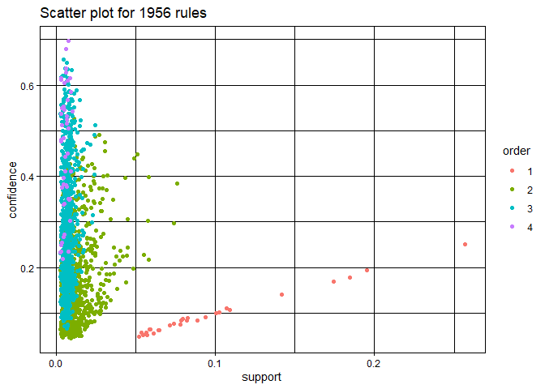

# DataMining\_PS4

## Pranjal Maheshka, Asha Christensen, Marco Navarro

### 2023-04-17

## Question 2 Market segmentation

In order to carry out this market segmentation exercise for NutrientH20,
we used tweets from followers of the Twitter account of the brand. Each
tweet was categorized based on its content using a pre-specified scheme
of 36 different categories, each representing a broad area of interest
(e.g. politics, sports, family, etc.).

First of all, we eliminate some categories of the data base that do not
add interesting information, such as “spam”, “adult” and “chatter”.
Then, we calculate the ratio between the number of posts by a given user
that fell into the given category and the total number annotations for
each user before centering and scaling the data.

For the market segmentation we try to divide followers (probably
costumers) into different groups according to similarities in their
tweets categories. Once we have identified these groups, the company
will have more knowledge about their followers (costumers) and design
marketing strategies accordingly.

In order to separate followers in distinct groups, we use a popular
unsupervised learning method known as K-means++. As a result of this
process, we divide followers in 5 different clusters, and accounts whose
tweets are classified to the same or similar categories end up in the
same group, cluster or market segment. The elbow plot suggests more
clusters, but we pick 5 in order to facilitate the interpretation of our
results.

Once we have identified these 5 clusters, we need to associate each
cluster to a category or set of categories in order to provide more
useful information. To accomplish that, we perform a principal component
analysis in order to know which principal component is more related to
each cluster and then analyze the loadings principal components.

In the following graphs, we can visualize relationships between each
cluster and the principal components. These relationships and the
loadings of the principal components can be used to identify relevant
categories for each cluster.

<table>
<colgroup>
<col style="width: 12%" />
<col style="width: 12%" />
<col style="width: 12%" />
<col style="width: 12%" />
<col style="width: 12%" />
<col style="width: 12%" />
<col style="width: 12%" />
<col style="width: 12%" />
</colgroup>
<thead>
<tr class="header">
<th>Category</th>
<th style="text-align: center;">Loadings PC1</th>
<th>Category</th>
<th style="text-align: center;">Loadings PC2</th>
<th>Category</th>
<th style="text-align: center;">Loadings PC3</th>
<th>Category</th>
<th style="text-align: center;">Loadings PC4</th>
</tr>
</thead>
<tbody>
<tr class="odd">
<td>sports_fandom</td>
<td style="text-align: center;">0.404690305</td>
<td>politics</td>
<td style="text-align: center;">0.261102608</td>
<td>politics</td>
<td style="text-align: center;">0.357194859</td>
<td>fashion</td>
<td style="text-align: center;">0.2486018310</td>
</tr>
<tr class="even">
<td>religion</td>
<td style="text-align: center;">0.400669823</td>
<td>travel</td>
<td style="text-align: center;">0.236649408</td>
<td>news</td>
<td style="text-align: center;">0.329012235</td>
<td>beauty</td>
<td style="text-align: center;">0.2366545788</td>
</tr>
<tr class="odd">
<td>parenting</td>
<td style="text-align: center;">0.378260522</td>
<td>college_uni</td>
<td style="text-align: center;">0.203784704</td>
<td>health_nutrition</td>
<td style="text-align: center;">0.278810631</td>
<td>cooking</td>
<td style="text-align: center;">0.2320392878</td>
</tr>
<tr class="even">
<td>food</td>
<td style="text-align: center;">0.285342668</td>
<td>tv_film</td>
<td style="text-align: center;">0.174483882</td>
<td>personal_fitness</td>
<td style="text-align: center;">0.265768747</td>
<td>politics</td>
<td style="text-align: center;">0.2253890276</td>
</tr>
<tr class="odd">
<td>school</td>
<td style="text-align: center;">0.254633402</td>
<td>current_events</td>
<td style="text-align: center;">0.153131682</td>
<td>outdoors</td>
<td style="text-align: center;">0.264414042</td>
<td>photo_sharing</td>
<td style="text-align: center;">0.1936194074</td>
</tr>
<tr class="even">
<td>.</td>
<td style="text-align: center;">.</td>
<td>.</td>
<td style="text-align: center;">.</td>
<td>.</td>
<td style="text-align: center;">.</td>
<td>.</td>
<td style="text-align: center;">.</td>
</tr>
<tr class="odd">
<td>outdoors</td>
<td style="text-align: center;">-0.144632427</td>
<td>cooking</td>
<td style="text-align: center;">-0.20634821</td>
<td>school</td>
<td style="text-align: center;">-0.155270893</td>
<td>food</td>
<td style="text-align: center;">-0.1071448600</td>
</tr>
<tr class="even">
<td>fashion</td>
<td style="text-align: center;">-0.183544726</td>
<td>food</td>
<td style="text-align: center;">-0.231026889</td>
<td>photo_sharing</td>
<td style="text-align: center;">-0.224246899</td>
<td>tv_film</td>
<td style="text-align: center;">-0.151685085</td>
</tr>
<tr class="odd">
<td>personal_fitness</td>
<td style="text-align: center;">-0.225382342</td>
<td>outdoors</td>
<td style="text-align: center;">-0.272709650</td>
<td>cooking</td>
<td style="text-align: center;">-0.243277175</td>
<td>sports_playing</td>
<td style="text-align: center;">-0.2903722124</td>
</tr>
<tr class="even">
<td>health_nutrition</td>
<td style="text-align: center;">-0.243124199</td>
<td>personal_fitness</td>
<td style="text-align: center;">-0.381209631</td>
<td>beauty</td>
<td style="text-align: center;">-0.321209763</td>
<td>online_gaming</td>
<td style="text-align: center;">-0.4735595614</td>
</tr>
<tr class="odd">
<td>cooking</td>
<td style="text-align: center;">-0.275127013</td>
<td>health_nutrition</td>
<td style="text-align: center;">-0.404175549</td>
<td>fashion</td>
<td style="text-align: center;">-0.339373781</td>
<td>college_uni</td>
<td style="text-align: center;">-0.4931870468</td>
</tr>
</tbody>
</table>

The first cluster is associated with positive values of the second and
third principal component (PC2 and PC3). Taking that information into
account and looking at the loadings, we can conclude that important
categories of this cluster are politics, travel, college\_uni, tv\_film,
current\_events, news, health\_nutrition and personal\_fitness.
Consequently, this market segment includes young adults who are probably
in college and are political enthusiasts. They also have a healthy
lifestyle and are also well aware of the current social and political
problems.

The second cluster is associated with positive values of PC2 and
negative values of PC5. In this cluster, the important categories are
politics, travel, college\_uni, tv\_film, current\_events,
news,cshopping, photo\_sharing and eco. It is similar to the firs group
(college students and interested in politics and current events), but
they are probably also interested in spending their free time shopping,
creating social media content instead of doing physical activities.

The third cluster is associated with positive values of PC2 and PC5. For
this cluster, important categories are politics, travel,
college\_uni,tv\_film, current\_events, news, fashion, cooking and
beauty. Again, this group includes young adults in college, and they
care about their appearance and political events.

The fourth cluster is associated with negative values of PC2. The most
important categories with negative loadings in this component are
health\_nutrition, personal\_fitness, outdoors and cooking. So, we can
conclude that one of the market segments is composed by people with an
active and healthy lifestyle who spend a considerable part of their free
time doing physical activities, and also cares about the type of food
they consume.

The last cluster is associated to negative values of PC3. Categories
with the lowest negative loadings in PC3 are
fashion,cbeauty,ccooking,cphoto\_sharing,cschool and religion. As a
result, we can conclude that one of the market segments includes adults
with kids who spend a considerable amount of time sharing content on
social media. In addition, they care about religion and are concerned
about their own appearance.

The information about the clusters can provide a better understanding of
the groups of costumers or potential ones, so the company is in a better
position to successfully design marketing campaigns for these different
groups.

## Question 3: Association rules for grocery purchases

First, let’s create a very broad associations model by using thresholds
that are very low (support = 0.005, confidence = 0.05). We allow up to 4
goods to be correlated:

    ## PhantomJS not found. You can install it with webshot::install_phantomjs(). If it is installed, please make sure the phantomjs executable can be found via the PATH variable.

Here we can see strong 2-way rule associations: ham and white bread,
tropical fruit and whole milk, butter and whipped cream, etc. However,
it may be the case that whole milk and tropical fruit are just 2 of the
most common items, meaning that we are not really capturing an
association, but rather just a result of this dual commonality, as seen
below.

    itemFrequencyPlot(grocerytrans, topN=10,  cex.names=1)

If we are using this data analysis for a practical purpose, such as
marketing, then we will want these rules to be relevant to a larger
number of individuals and more true for those individuals. This means
that we should set our confidence and support higher: I don’t care about
rules which impact less than 1% of consumers, and I don’t care about
rules which are true less than 50% of the time. Therefore, we can rerun
the apriori function with support = 0.01 and confidence = 0.5:

We do have much less rules, however, the rules that remain are
applicable to a larger portion of shoppers and are more strongly true,
and are therefore more relevant to application

    subrules = head(groceryrules2, n=10, by="lift")
    plot(subrules, method = "graph", engine = "htmlwidget")

    plot(subrules, method="paracoord")

